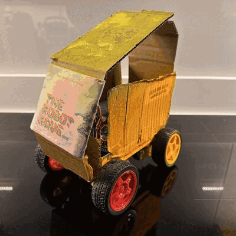

# Robot Rave

<div align="center">
  <a href="https://sergiopesch.github.io/robot-rave/">
    
  </a>
  <br>
  <em>Meet Ravitto - The Dancing Robot!</em>
  <br><br>
  <a href="https://sergiopesch.github.io/robot-rave/">Experience 3D Gaussian Splat Viewer</a>
</div>

<br>

A music-reactive dancing robot built on Raspberry Pi that dances to the beat of your music with LED matrix eyes that express emotions.

## Origin

This project started as a hackathon project at the **SoTa (State of the Art) event with Cocoa** called **"The Robot Rave"**. What began as an experimental idea to make a robot dance to music has evolved into a full-featured music-reactive robot with personality!

## Features

- **Music-Reactive Dancing**: Real-time beat detection and BPM analysis to sync robot movements with music
- **LED Matrix Eyes**: Freenove 8x16 LED matrix displays expressive eye animations that react to music and movement
- **Multiple Dance Patterns**: Various dance styles including bounce, sway, shuffle, pump, and more
- **Autonomous Mode**: Robot listens for music and automatically starts/stops dancing
- **Web Interface**: Beautiful responsive control panel accessible from any device on the network
- **Audio Visualization**: Real-time waveform and spectrum analyzer display
- **Smart Silence Detection**: Robot stops dancing within ~500ms when music stops
- **3D Gaussian Splat Viewer**: Immersive WebGL visualization of Ravitto with 50k+ particles

## 3D Gaussian Splat Viewer

Experience Ravitto in a stunning 3D particle cloud visualization! The Gaussian splat viewer renders the robot as thousands of floating particles with realistic colors and lighting.

**Features:**
- **50,000+ Particles**: High-fidelity point cloud forming Ravitto's shape
- **Orbital Controls**: Drag to rotate, scroll to zoom, double-click to reset
- **Quality Levels**: 1x (25k) to 8x (200k) particles for any device
- **Color Modes**: Normal, Neon, Thermal, and Golden rendering styles
- **Explode Effect**: Watch particles burst outward and reform
- **Auto-Rotate**: Cinematic orbiting camera animation

**Browser Requirements:**
- Modern browser with WebGL support (Chrome, Firefox, Safari, Edge)
- Hardware acceleration enabled
- For best performance: dedicated GPU recommended for 4x/8x quality modes

Access at `/splat` when running the backend, or view the [live demo](https://sergiopesch.github.io/robot-rave-/ravitto_splat.html).

**Troubleshooting:**
- If the viewer shows a black screen, check that WebGL is enabled in your browser
- For slow performance, try reducing quality to 1x or 2x mode
- On mobile devices, start with 1x quality for smoother experience

## Hardware Requirements

- Raspberry Pi 4 (or 3B+)
- CamJam EduKit 3 (or compatible motor driver)
- 2x DC Motors with wheels
- USB Microphone
- Freenove 8x16 LED Matrix (HT16K33) - Optional but recommended
- Power supply for motors

## Wiring

### Motor Connections (CamJam EduKit 3)
| Motor | GPIO Pin 1 | GPIO Pin 2 |
|-------|------------|------------|
| Left  | 9          | 10         |
| Right | 7          | 8          |

### LED Matrix (I2C)
| Matrix Pin | Pi Pin |
|------------|--------|
| VCC        | 3.3V   |
| GND        | GND    |
| SDA        | SDA    |
| SCL        | SCL    |

### Status LED
| LED    | GPIO Pin |
|--------|----------|
| Status | 25       |

## Installation

### 1. Enable I2C (for LED eyes)
```bash
sudo raspi-config
# Navigate to: Interface Options > I2C > Enable
```

### 2. Install System Dependencies
```bash
sudo apt-get update
sudo apt-get install -y portaudio19-dev i2c-tools
```

### 3. Install Python Dependencies
```bash
pip3 install flask numpy sounddevice scipy --break-system-packages
pip3 install adafruit-circuitpython-ht16k33 --break-system-packages
```

### 4. Verify I2C Connection (optional)
```bash
i2cdetect -y 1
# Should show devices at 0x70 and 0x71 for the LED matrix
```

## Usage

### Start the Robot
```bash
cd /path/to/robot-rave
python3 robot_backend.py
```

### Access the Web Interface
Open a browser and navigate to:
- From the Pi: `http://localhost:5000`
- From another device: `http://<pi-ip-address>:5000`

### Controls
- **START AUTONOMOUS MODE**: Robot listens for music and dances automatically
- **Manual Controls**: D-pad for direct motor control
- **Sensitivity Slider**: Adjust music detection sensitivity
- **Gain Slider**: Adjust microphone input gain
- **EMERGENCY STOP**: Immediately stops all movement

## Project Structure

```
robot-rave/
├── robot_backend.py      # Main backend server with all logic
├── robot_frontend.html   # Web interface (served by Flask)
├── ravitto_studio.html   # Interactive 360° photo viewer
├── ravitto_splat.html    # 3D Gaussian splat WebGL viewer
├── ravitto_360.gif       # Robot showcase animation
├── images/               # Robot photos
├── README.md             # This file
├── CLAUDE.md             # Claude Code guidelines
└── AGENT.md              # AI assistant guidelines
```

## API Endpoints

| Endpoint | Method | Description |
|----------|--------|-------------|
| `/` | GET | Serves the web frontend |
| `/splat` | GET | 3D Gaussian splat viewer |
| `/studio` | GET | Interactive 360° photo studio |
| `/api/status` | GET | Returns current robot state as JSON |
| `/api/control/<cmd>` | POST | Send control commands (forward, backward, left, right, stop, toggle_auto) |
| `/api/sens/<val>` | POST | Set sensitivity (0-100) |
| `/api/gain/<val>` | POST | Set microphone gain (0-100) |
| `/api/eyes/<expression>` | POST | Set eye expression |
| `/api/eyes/special/<type>` | POST | Trigger special eye animation |

## Eye Expressions

The LED matrix eyes support multiple expressions:
- `normal` - Default relaxed eyes
- `happy` - Curved happy eyes
- `excited` - Wide open eyes
- `sleepy` - Droopy tired eyes
- `angry` - Furrowed brow
- `look_left`, `look_right`, `look_up` - Directional looking

Special animations: `heart`, `star`, `dizzy`

## How It Works

1. **Audio Capture**: USB microphone captures ambient audio at 44.1kHz
2. **Feature Extraction**: Analyzes RMS energy, spectral features, and frequency bands
3. **Beat Detection**: Identifies beats using onset detection and tempo estimation
4. **Music Classification**: Distinguishes music from silence, noise, and speech
5. **Dance Engine**: Selects appropriate dance patterns based on BPM, energy, and dominant frequency band
6. **Motor Control**: Executes dance moves through PWM-controlled DC motors
7. **Eye Animation**: Updates LED matrix based on energy, beats, and movement direction

## Contributing

Contributions are welcome! Feel free to submit issues and pull requests.

## License

MIT License - Feel free to use, modify, and distribute.

## Acknowledgments

- **SoTa Event & Cocoa** - For hosting the hackathon that sparked this project
- **CamJam EduKit** - For the excellent robotics kit
- **Adafruit** - For the HT16K33 LED matrix library
- All the hackathon participants who cheered on the dancing robot!

---

*Made with music and motors at The Robot Rave hackathon*
